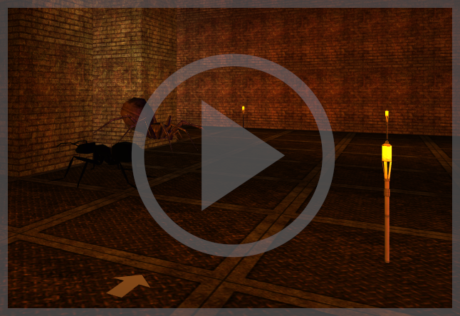

# Creating User Interfaces final project
University of Las Palmas de Gran Canaria, summer 2020
## Group: 
* [Anna Zawadzka](https://github.com/azawadzka)
* [Alexander Soremba](https://github.com/Rednaxelus)
* [Ismael Aarab Umpiérrez](https://github.com/canary255)
* [Ruben García Quintana](https://github.com/RubenGQ97)

#### Steering: 
mouse left-right: rotation of view

mouse up-down: height of torch

additional buttons, information during gameplay

or

an Arduino gamepad (created by us for the pursose of this game)

#### Plot
The game consists in finding all items required to access the door and escaping the room, avoiding enemies at all times. The user has a torch to his disposal, as the room is dark and not all elements may be visible.

The project is an extension of <a href="https://github.com/azawadzka/ULPGC-CIU-Graphics#5-museum">an individual project</a> made in the same course. 

#### Technologies:
Java Standard

Processing

Arduino

